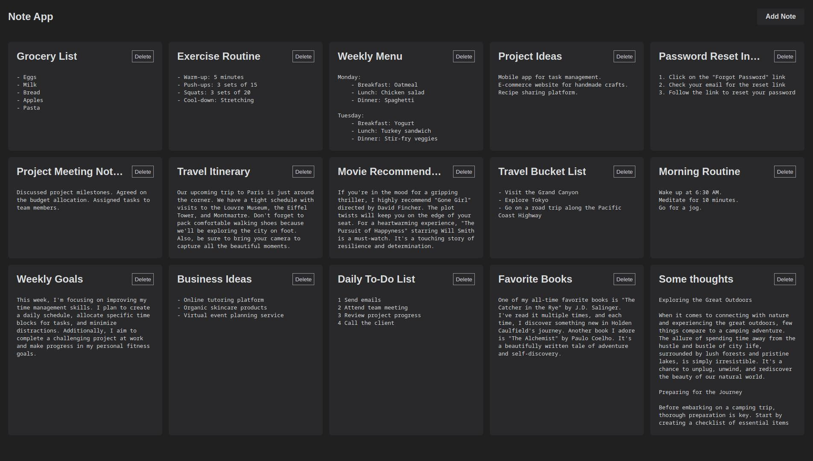
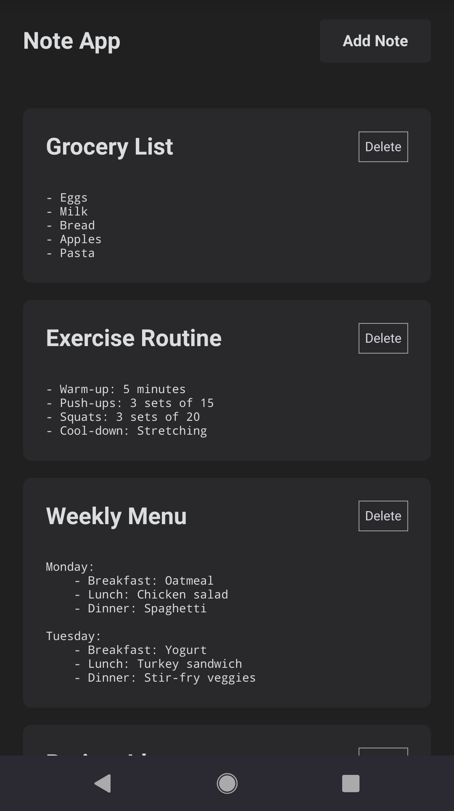
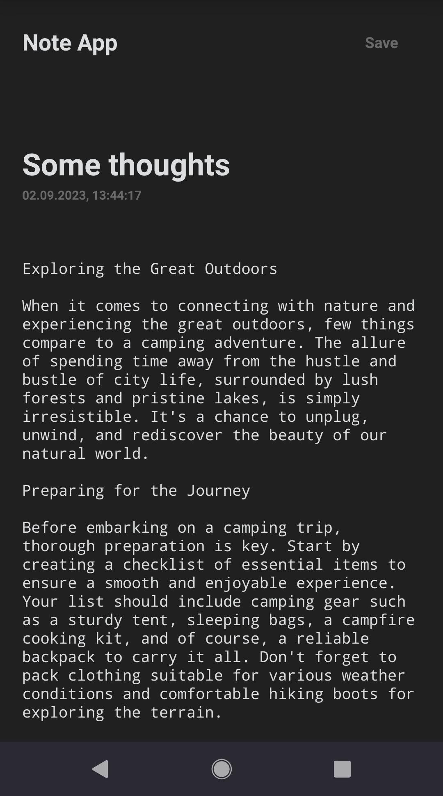

# Simplest notes web app

## Table of Contents

- [About](#about)
- [Features](#features)
- [Technologies Used](#technologies-used)
- [Getting Started](#getting-started)
  - [Prerequisites](#prerequisites)
  - [Installation](#installation)
- [Usage](#usage)
- [API Reference](#api-reference)
- [Contributing](#contributing)
- [License](#license)

---

## About

The Note Web App is a modern and user-friendly web application designed to help you organize your notes with ease. It provides a clean and intuitive interface for creating, viewing, editing, and deleting notes. Features a RESTful API, enabling CRUD operations for managing notes, all wrapped in a SPA frontend powered by Vue.

<p align="center">
  
  
  
</p>

---

## Features

- **Create Notes**: Add new notes with titles and text.
- **View Notes**: See a list of all your notes.
- **Edit Notes**: Update your notes with ease.
- **Delete Notes**: Remove notes that you no longer need.
- **Responsive Design**: Enjoy a seamless experience on various devices.

---

## Technologies Used

- **Frontend**:
  - [Vue.js](https://vuejs.org/): A progressive JavaScript framework.
  - [Vue Router](https://router.vuejs.org/): Client-side routing for Vue apps.
  - HTML and CSS for the user interface.

- **Backend**:
  - [Node.js](https://nodejs.org/): A JavaScript runtime.
  - [Express.js](https://expressjs.com/): A web application framework for Node.js.
  - [MongoDB](https://www.mongodb.com/): A NoSQL database for data storage.

---

## Getting Started

### Prerequisites

- Node.js and npm (Node Package Manager) installed on your system.
- MongoDB installed and running (for backend data storage). You may use Docker: 

    ```sh
    docker run -d -p 27017:27017 --name mongodb mongo
    ```

### Installation

1. **Clone the repository**:

   ```sh
   git clone https://github.com/kosttykov/simplest-note-web-app.git
   ```

2. **Navigate to the project directory**:

   ```sh
   cd simplest-note-web-app
   ```

3. **Install dependencies for the frontend**:

   ```sh
   cd frontend
   npm install
   ```

4. **Install dependencies for the backend**:

   ```sh
   cd ../backend
   npm install
   ```

5. **Configure your MongoDB connection**:

   - Fill a `.env` file in the `/backend` directory with your MongoDB connection URL:

     ```
     MONGO_URL=your-mongodb-connection-url
     ```

6. **Start the backend server**:

   ```sh
   npm start
   ```

7. **Start the frontend application**:

   ```sh
   cd ../frontend
   npm run serve
   ```

8. **Open your browser and visit**:

   ```
   http://localhost:8080
   ```

---

## Usage

- **Create a Note**: Click the "Add Note" button to create a new note. Fill in the title and text, then click "Save."

- **View & Edit Notes**: Click on a note to update its title or text. Browse through your list of notes. Each note displays its title, date created and a snippet of text.

- **Delete a Note**: To remove a note, click the "Delete" button. Be careful; this action is irreversible!

---

## API Reference

The Note Web App communicates with the backend server using RESTful API endpoints. Here are the available API routes:

- **GET /api/notes/getall**: Get a list of all notes.
- **GET /api/notes/get/:id**: Get a specific note by ID.
- **POST /api/notes/add**: Create a new note.
- **PUT /api/notes/update/:id**: Update a note by ID.
- **DELETE /api/notes/delete/:id**: Delete a note by ID.

---

## Contributing

Contributions are welcome! Feel free to open issues and pull requests. For major changes, please open an issue first to discuss what you would like to change.

---

## License

This project is licensed under the [MIT License](LICENSE).

---

<p align="center">
  &copy; 2023 kosttykov
</p>
